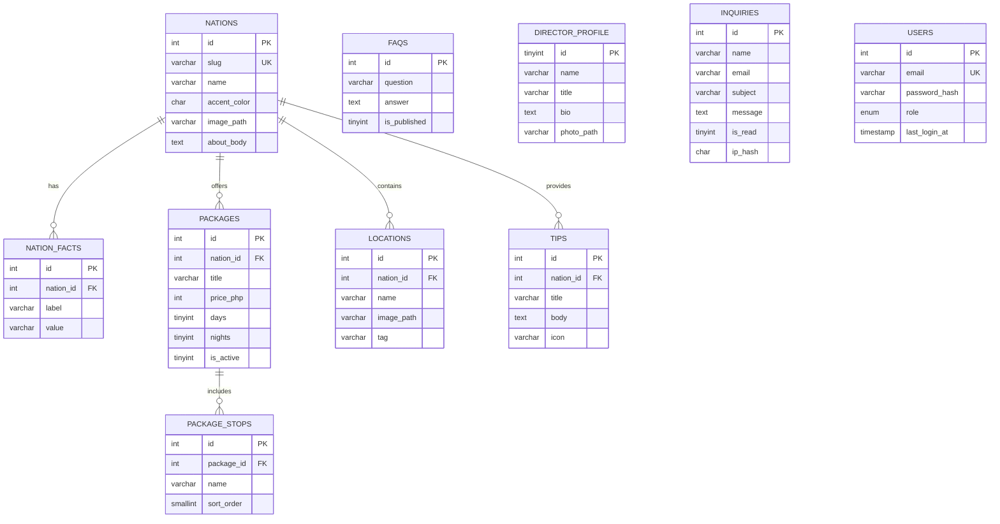

# Teyvat Travels Database Diagram

```mermaid
erDiagram
    NATIONS ||--o{ NATION_FACTS : has
    NATIONS ||--o{ PACKAGES : offers
    NATIONS ||--o{ LOCATIONS : contains
    NATIONS ||--o{ TIPS : provides
    PACKAGES ||--o{ PACKAGE_STOPS : includes

    NATIONS {
        int id PK
        varchar slug UK
        varchar name
        char accent_color
        varchar image_path
        text about_body
    }

    NATION_FACTS {
        int id PK
        int nation_id FK
        varchar label
        varchar value
    }

    PACKAGES {
        int id PK
        int nation_id FK
        varchar title
        int price_php
        tinyint days
        tinyint nights
        tinyint is_active
    }

    PACKAGE_STOPS {
        int id PK
        int package_id FK
        varchar name
        smallint sort_order
    }

    LOCATIONS {
        int id PK
        int nation_id FK
        varchar name
        varchar image_path
        varchar tag
    }

    TIPS {
        int id PK
        int nation_id FK
        varchar title
        text body
        varchar icon
    }

    FAQS {
        int id PK
        varchar question
        text answer
        tinyint is_published
    }

    DIRECTOR_PROFILE {
        tinyint id PK
        varchar name
        varchar title
        text bio
        varchar photo_path
    }

    INQUIRIES {
        int id PK
        varchar name
        varchar email
        varchar subject
        text message
        tinyint is_read
        char ip_hash
    }

    USERS {
        int id PK
        varchar email UK
        varchar password_hash
        enum role
        timestamp last_login_at
    }
```
